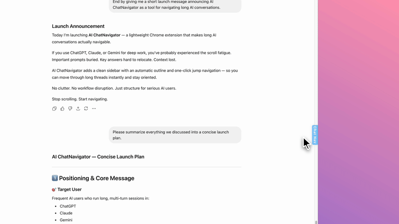
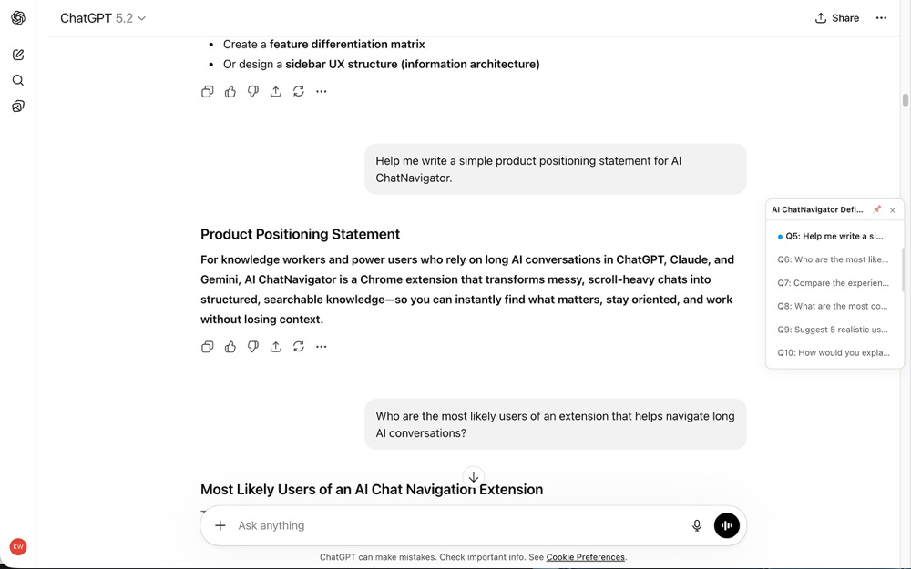
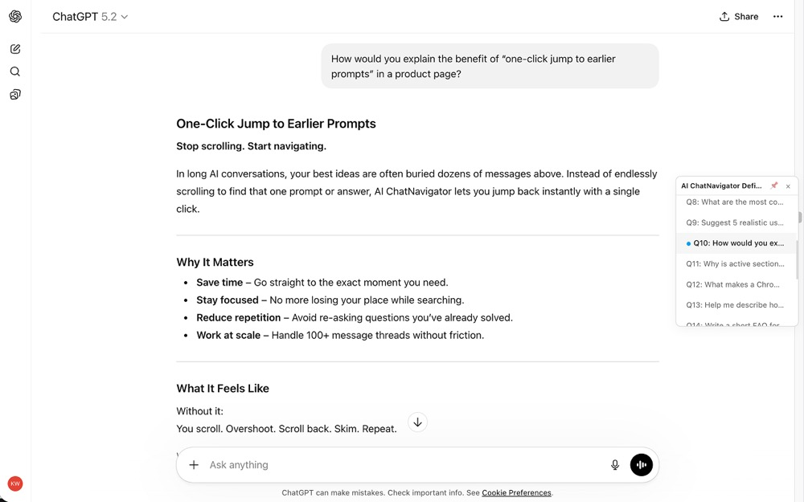
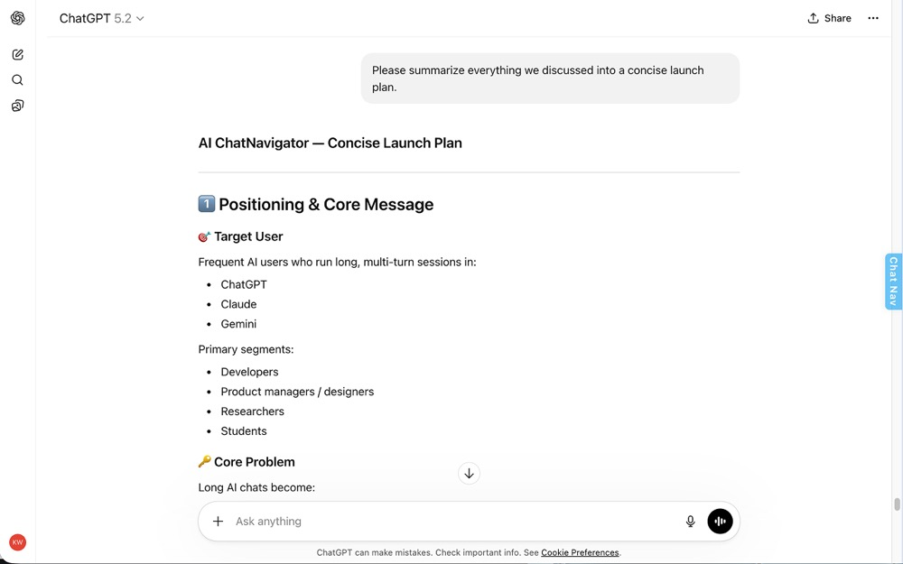

# AI ChatNavigator

> A Chrome extension that adds a floating table of contents to ChatGPT, Claude, and Gemini — navigate long AI conversations instantly.

[](https://chromewebstore.google.com/detail/ai-chatnavigator/illmkheigijhoimkdghiaanedpinibmc?authuser=0&hl=en)
[]()
[]()
[]()



## What It Does

Every user prompt becomes a clickable entry in a sidebar. Click any entry to jump straight to that message.

**Supported platforms:** ChatGPT · Claude · Gemini

## Features

- **Real-time TOC** — automatically generated from your prompts as you chat
- **One-click navigation** — jump to any earlier message with highlight animation
- **Active tracking** — the current prompt is highlighted as you scroll
- **Pin or auto-hide** — keep the sidebar open or let it appear on hover
- **Dark mode** — adapts to each platform's theme
- **Privacy-first** — 100% local processing, zero external requests, no account needed

## Screenshots

<p align="center">
  
  
  
</p>

## Install

**[→ Install from Chrome Web Store](https://chromewebstore.google.com/detail/ai-chatnavigator/illmkheigijhoimkdghiaanedpinibmc?authuser=0&hl=en)**

Or load manually for development:

1. Clone this repo
2. Open `chrome://extensions` → enable Developer Mode
3. Click "Load unpacked" → select the project folder

## How It Works

The extension uses a platform adapter pattern — each supported site has its own adapter that handles DOM selectors and route matching, while shared modules manage the sidebar UI, state machine, and observers.

```
AI_ChatNavigator/
├── manifest.json              # Manifest V3 config
├── content/
│   ├── content.js             # Entry point, adapter detection, retry logic
│   ├── observer.js            # MutationObserver + IntersectionObserver + SPA nav
│   ├── sidebar.js             # Sidebar UI, state machine, TOC rendering
│   └── adapters/
│       ├── chatgpt.js         # ChatGPT adapter
│       ├── claude.js          # Claude adapter
│       └── gemini.js          # Gemini adapter
├── styles/sidebar.css         # Sidebar styles (light/dark)
├── popup/                     # Extension popup
└── icons/                     # Extension icons
```

### Key technical decisions

- **Vanilla JS, no build step, zero dependencies** — keeps the extension lightweight and easy to audit
- **Adapter pattern** — platform-specific DOM logic stays isolated; adding a new platform means adding one file
- **Route-based matching** — adapters match on hostname + URL path, not DOM elements, so empty conversations work correctly
- **Triple observer setup** — MutationObserver for new messages, IntersectionObserver for active tracking, URL polling for SPA navigation
- **Minimal permissions** — only `storage` (for sidebar pin/close state)

## Privacy

- No data leaves your browser
- No external requests, analytics, or tracking
- No account or login required
- Only permission: `storage` (sidebar UI preferences)

## Known Limitations

- Depends on platform DOM structure — adapters may need updates when ChatGPT, Claude, or Gemini change their frontend
- Behavior may vary during platform A/B tests or redesigns

## Contributing

Found a bug or selector that broke? Issues and PRs welcome.

If a platform changed its DOM and the extension stopped working, the fix is usually in the corresponding adapter file under `content/adapters/`.

## License

All rights reserved unless a license is added explicitly in the future.
