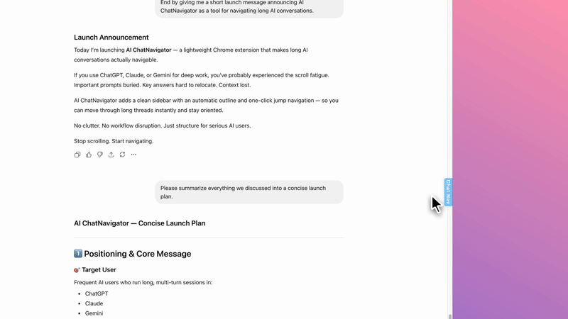
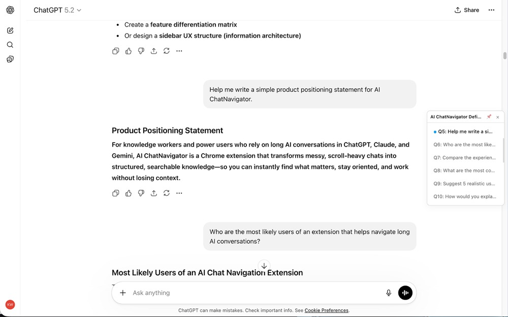
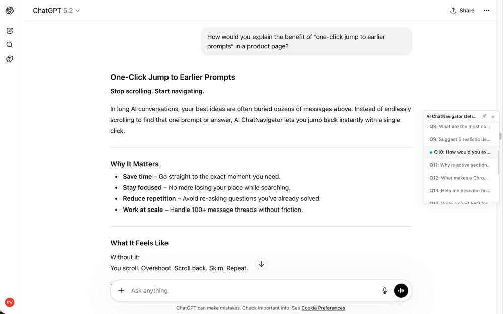
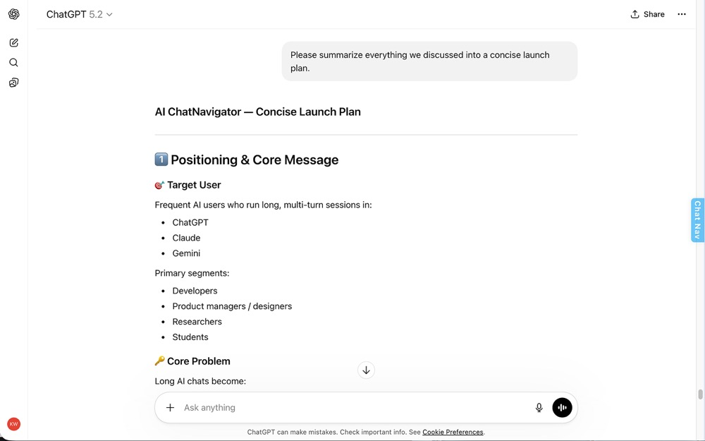

<div align="center">
  <h1>AI ChatNavigator</h1>
  <p>
    <a href="https://www.producthunt.com/products/ai-chat-navigator?embed=true&utm_source=badge-featured&utm_medium=badge&utm_campaign=badge-ai-chat-navigator">
      
    </a>
  </p>
  <p>Find earlier prompts in long ChatGPT, Claude, and Gemini conversations with a floating table of contents.</p>
  <p>
    <a href="https://chromewebstore.google.com/detail/ai-chatnavigator/illmkheigijhoimkdghiaanedpinibmc?authuser=0&hl=en">
      
    </a>
    <a href="https://github.com/kamiimeteor/AI-ChatNavigator/releases/tag/v1.0.3">
      
    </a>
    
    
    
  </p>
</div>



## What it does

AI ChatNavigator is a Chrome extension that turns loaded user prompts into clickable sidebar entries. Click an entry to jump to that message, or scroll through the conversation and follow the highlighted prompt.

On ChatGPT, the sidebar keeps prompts it has already read while their virtual placeholders remain on the page. On opening a chat, it briefly scrolls through unread placeholders and restores your reading position. Any manual interaction stops that loading. Claude and Gemini list currently loaded prompts. Conversation text is not saved across page reloads.

**Supported chat platforms:** ChatGPT · Claude · Gemini

## 1.0.4 repository update

Version 1.0.4 fixes ChatGPT prompt counts during scrolling, loads earlier prompts after refresh, and keeps the active outline entry aligned with the answer you are reading. Jump targets get a 2px violet outline at 50% opacity, held for 1.5 seconds before fading out over 0.2 seconds.

The [1.0.4 package](release/AI-ChatNavigator-v1.0.4-chrome.zip) includes these changes. See the [release notes](docs/releases/1.0.4.md) for validation and limitations. This version has not been submitted to the Chrome Web Store; the store version remains 1.0.3.

## What's new in 1.0.3

1. The outline updates changed entries during streamed replies while preserving keyboard focus and the sidebar's scroll position.
2. Jumping to a prompt stops when you scroll, touch the page, press a scroll key, choose another prompt, close the sidebar, or switch chats. A jump makes at most one short follow-up position correction.
3. Message matching uses live nodes and message IDs. If an edited or removed prompt cannot be identified safely, the sidebar shows a notice instead of choosing a target by repeated text or list position.
4. Loading, empty-chat, and error states include clearer feedback and a **Retry** action. The extension can reconnect when a site replaces its conversation container.
5. Sidebar controls support Tab/Enter and respect reduced-motion settings. The popup distinguishes supported, loading, and unsupported pages; extension logs omit conversation text.

Read the [English release notes](docs/releases/1.0.3.en.md), [中文更新说明](docs/releases/1.0.3.md), or [download v1.0.3](https://github.com/kamiimeteor/AI-ChatNavigator/releases/tag/v1.0.3).

## Features

- A live prompt outline with active-message highlighting as you scroll.
- Click-to-jump navigation that yields to your next action.
- A sidebar you can pin open or reveal on hover, with light and dark themes.
- Keyboard-accessible controls, loading feedback, and retry support.
- Local processing with no external requests, analytics, or extension account.

## Screenshots

<p align="center">
  
  
  
</p>

## Install

**[→ Install from Chrome Web Store](https://chromewebstore.google.com/detail/ai-chatnavigator/illmkheigijhoimkdghiaanedpinibmc?authuser=0&hl=en)**

### Install v1.0.3 from GitHub

1. Download `AI-ChatNavigator-v1.0.3-chrome.zip` from the [v1.0.3 release](https://github.com/kamiimeteor/AI-ChatNavigator/releases/tag/v1.0.3) and extract it.
2. Open `chrome://extensions` and enable **Developer mode**.
3. Choose **Load unpacked** and select the extracted folder containing `manifest.json`.
4. Refresh existing ChatGPT, Claude, or Gemini tabs.

The GitHub release includes a SHA-256 checksum and source provenance file. Chrome Web Store availability follows its own review and rollout schedule.

For local development, clone this repository and load the project folder through **Load unpacked**. After changing the source, reload the extension in `chrome://extensions` and refresh your chat tabs.

## Supported pages

| Platform | Routes enabled in v1.0.3 |
|---|---|
| ChatGPT | `chatgpt.com` and `chat.openai.com`: `/` and `/c/<id>` |
| Claude | `claude.ai`: `/`, `/new`, and `/chat/<id>` |
| Gemini | `gemini.google.com`: `/app` and paths under it, including `/u/<number>/app` |

These are the adapter's route rules, not a guarantee that every live interface variant has been verified. Project-specific, custom assistant, shared, and agent/work pages outside these rules are not supported.

## How it works

Each supported site has an adapter for DOM selectors and route matching. Shared modules manage message identity, navigation, the sidebar UI, and page observers.

```
AI_ChatNavigator/
├── manifest.json              # Chrome Manifest V3 config
├── content/
│   ├── content.js             # Entry point, adapter detection, retry logic
│   ├── message-index.js       # Snapshot identity and safe message resolution
│   ├── navigation.js          # Cancellable scrolling
│   ├── history-loader.js      # Bounded ChatGPT history loading and position restoration
│   ├── observer.js            # Batched DOM updates + active tracking + URL polling
│   ├── sidebar.js             # Sidebar UI, state machine, TOC rendering
│   └── adapters/
│       ├── common.js         # Shared extraction and scroll-container detection
│       ├── chatgpt.js         # ChatGPT adapter
│       ├── claude.js          # Claude adapter
│       └── gemini.js          # Gemini adapter
├── scripts/build-chrome-release.mjs # Creates the Chrome release zip
├── styles/sidebar.css         # Sidebar styles (light/dark)
├── popup/                     # Extension popup
└── icons/                     # Extension icons
```

### Key technical decisions

- **Vanilla JS, optional release build, zero runtime dependencies**: keeps the extension lightweight and easy to audit
- **Adapter pattern**: platform-specific DOM logic stays isolated; new platforms need an adapter and the corresponding manifest, popup, and test updates
- **Route-based matching**: adapters match on hostname + URL path, not DOM elements, so empty conversations work correctly
- **Lifecycle recovery**: batched DOM observation, active tracking, URL polling, and periodic checks for replaced containers
- **Minimal permissions**: only `storage` (for sidebar pin state)

## Tests and release build

Run the dependency-free regression tests:

```sh
node --test tests/*.test.cjs
```

The browser regression suite uses synthetic pages and loads the real extension in temporary Chrome profiles. It requires Chrome and a development copy of Playwright available to Node (for example through `NODE_PATH`):

```sh
node tests/browser.cjs
```

Screenshots and results are written to a temporary directory outside this repository. Set `ACN_EXTENSION_DIR` to test a built unpacked directory instead of the source tree. The suite does not use your normal browser profile or contact the live chat services.

Build a release:

```sh
node scripts/build-chrome-release.mjs
```

The build checks JavaScript syntax, runs the regression tests, and packages an explicit file allowlist. It writes:

- `release/AI-ChatNavigator-v<version>-chrome.zip`
- SHA-256 and source provenance files beside the zip
- `dist/chrome-v<version>/` for **Load unpacked**

Existing release archives and unpacked release directories are not overwritten. A new release requires a new version. Refresh chat tabs after upgrading.

Version 1.0.4 has 53 passing logic tests. The user confirmed the ChatGPT count and navigation fixes on a signed-in conversation. The latest opacity adjustment, Claude/Gemini shared highlighting, and the native toolbar popup still need visual verification. The synthetic browser suite was last run for 1.0.3; see its [release notes](docs/releases/1.0.3.en.md) for that validation scope.

## Privacy

- No data leaves your browser
- No external requests, analytics, or tracking
- No account or login required
- Only permission: `storage` (sidebar UI preferences)

## Known limitations

- Depends on platform DOM structure: adapters may need updates when ChatGPT, Claude, or Gemini change their frontend
- Behavior may vary during platform A/B tests or redesigns; the existing floating sidebar can cover part of a narrow window
- ChatGPT indexing covers observed prompts and existing page placeholders. Automatic loading can stop on user input or reach its time limit; history not represented on the page can still be missing. Claude and Gemini list loaded prompts only
- If a prompt no longer has a unique live identity, navigation stops instead of guessing from its text or position
- Search, bookmarks, reading-position restoration across conversations, resizable panels, and Chrome's native Side Panel are not included in 1.0.3

## Contributing

Found a bug or selector that broke? Issues and PRs welcome.

If a platform changed its DOM and the extension stopped working, the fix is usually in the corresponding adapter file under `content/adapters/`.

## License

All rights reserved unless a license is added explicitly in the future.
